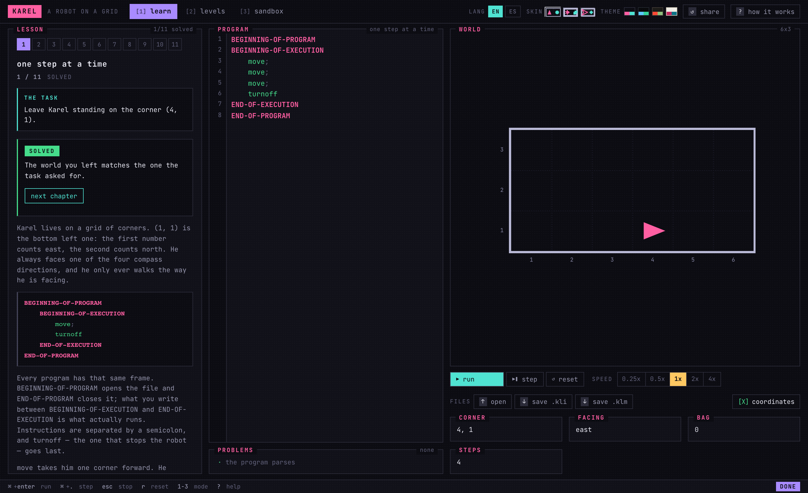
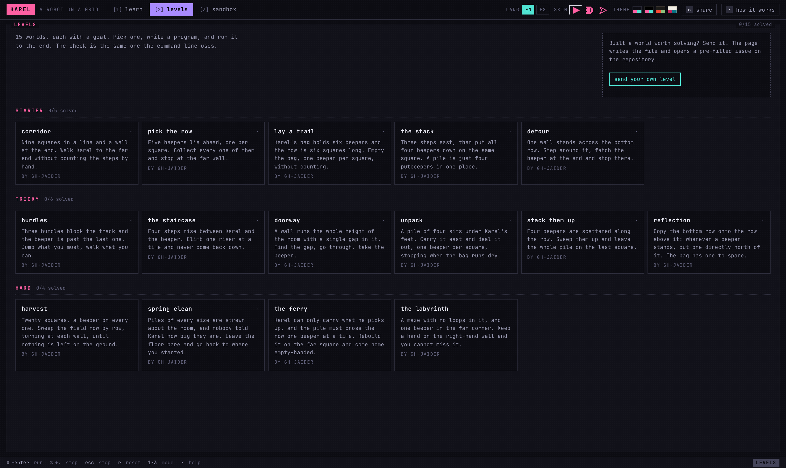
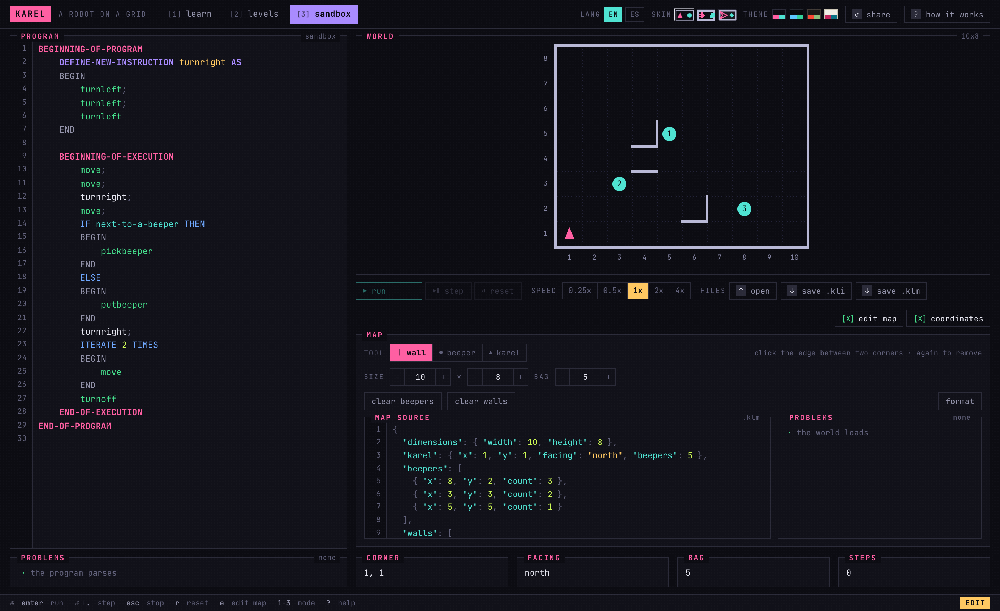

# Karel

**Karel the Robot, as a language you can actually build on.** A zero-dependency TypeScript
interpreter for the classic Karel language (the one from _Karel J. Robot_, with
`BEGINNING-OF-PROGRAM`, `DEFINE-NEW-INSTRUCTION` and `ITERATE n TIMES`) and the tools built
on top of it.

### → [Open it in your browser](https://gh-jaider.github.io/karel/)

Nothing to install, nothing to sign into. Eleven chapters that teach the language, fifteen
worlds to practise on, and a sandbox to play in.

[](https://github.com/GH-Jaider/karel/actions/workflows/ci.yml)

## In the browser

### learn

Eleven chapters, from the grid to a program that defines its own instructions and calls them
from a loop. Each one opens with a program that fails in a way worth reading, and checks your
answer when it runs.



### levels

Fifteen worlds in three bands. Built one worth solving? The page writes the file and opens a
pre-filled issue here, with the world, the goal and a reference solution all captured from one
run you just watched finish, so nobody can submit a level nobody can solve.



### sandbox

A world you build by hand: click an edge to raise a wall, a square to stack beepers, or edit it
as JSON beside the canvas. Open and save both formats; they are the same files the extension
opens and the CLI grades.



Four colour themes, three drawing styles, English and Spanish.

## What's here

| Package                              | What it is                                                                                                                                                                                            | Status  |
| ------------------------------------ | ----------------------------------------------------------------------------------------------------------------------------------------------------------------------------------------------------- | ------- |
| [`apps/web`](apps/web)               | **The playground**. Learn, practise and play, in English or Spanish. Write a program, watch the robot, build worlds by hand, and send anyone a link that opens exactly what you are looking at.       | Working |
| [`packages/core`](packages/core)     | `@karel/core`. Lexer, parser, interpreter and world model. No dependencies, no platform assumptions: it runs in a browser, in Node, or anywhere else with a timer.                                    | Working |
| [`packages/cli`](packages/cli)       | **karel**. Run a program against a world and check the result, so a class's submissions can be graded in a loop or in CI. A distinct exit code per outcome, and a `--timeout` so a batch always ends. | Working |
| [`packages/vscode`](packages/vscode) | **VS Karel**. Write, run and step through Karel programs inside VS Code, with the world drawn beside the code.                                                                                        | Working |

The interpreter is deliberately separate from whatever happens to host it, so the same
language, the same error messages and the same world semantics back every one of them. That
goes for grading too: the browser telling a student their chapter is solved runs the very same
comparison the command line grades a submission with, because two implementations would
eventually pass someone in one place and fail them in the other.

## Grading a class

```bash
for f in submissions/*.kli; do
  karel run "$f" -w start.klm -a solved.klm -t 10 >/dev/null 2>&1 \
    && echo "PASS $f" || echo "FAIL $f ($?)"
done
```

Exit codes separate _wrong answer_ from _does not compile_ from _never terminates_, so a marker
can tell those apart without reading a word of output. See
[the CLI's README](packages/cli/README.md).

## Working on it

```bash
git clone https://github.com/GH-Jaider/karel.git
cd karel
pnpm install          # also builds @karel/core, which everything else compiles against
pnpm test             # every suite
pnpm dev:web          # the playground, on a local server
```

To run the extension: open the repo in VS Code and press <kbd>F5</kbd>. The build task rebuilds
the core first, so a change to the interpreter shows up in the Extension Development Host.

| Command          | What it does                    |
| ---------------- | ------------------------------- |
| `pnpm build`     | Build every package, core first |
| `pnpm test`      | Run the test suites             |
| `pnpm typecheck` | Type-check every package        |
| `pnpm lint`      | Lint the workspace              |

`examples/` holds the fixtures the tests and the docs share: a program (`.kli`) and a world
(`.klm`). `apps/web/levels/` holds one JSON file per level, which is what makes contributing
one a matter of adding a file.

## The language

Programs are `.kli` files; worlds are `.klm` files, which are JSON with a
[schema](packages/vscode/schemas/klm.schema.json). The full reference, covering the five built-in
instructions, the eighteen conditions, the control structures and the world format, is in
the playground under **how it works**, and in
[the extension's README](packages/vscode/README.md#the-karel-language-kli).

## License

MIT © GH-Jaider
